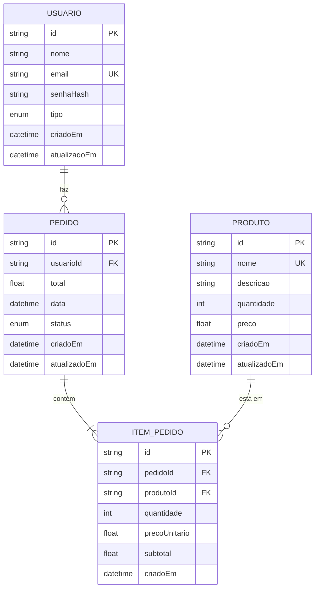

# Sistema E-commerce Overzone


Sistema completo de e-commerce com gerenciamento de estoque, autenticação de usuários e processamento de pedidos, desenvolvido como parte do Desafio Técnico da Overzone.

## Índice

- [Visão Geral](#visão-geral)
- [Quick Start](#quick-start)
- [Atendimento ao Desafio Técnico](#atendimento-ao-desafio-técnico)
- [Tecnologias Utilizadas](#tecnologias-utilizadas)
- [Funcionalidades Implementadas](#funcionalidades-implementadas)
- [Estrutura do Projeto](#estrutura-do-projeto)
- [Instalação e Execução](#instalação-e-execução)
- [Comandos Disponíveis](#comandos-disponíveis)
- [Guia de Uso](#guia-de-uso)
- [Estrutura do Banco de Dados](#estrutura-do-banco-de-dados)
- [APIs Disponíveis](#apis-disponíveis)
- [Troubleshooting](#troubleshooting)
- [Tecnologias e Conceitos Aplicados](#tecnologias-e-conceitos-aplicados)

## Visão Geral

Projeto desenvolvido como resposta ao [Desafio Técnico - Gerenciador de Estoque Básico](overzone-code-challenge-estoque-simples.pdf) da Overzone.

O projeto implementa um e-commerce full-stack com:

- Front-end em React com Next.js (Pages Router)
- Back-end integrado via API Routes
- Banco de dados SQLite com Prisma ORM
- Autenticação JWT com cookies httpOnly
- Sistema completo de gestão de produtos, pedidos e usuários

## Quick Start

```bash
# Clone e inicie com Docker (recomendado)
git clone https://github.com/jffilho618/Desafio-Overzone.git
cd Desafio-Overzone
docker-compose up
```

Acesse: http://localhost:3000

**Credenciais de teste:**

- Admin: `admin@overzone.com` / `admin123`
- Cliente: `joao@email.com` / `senha123`

## Atendimento ao Desafio Técnico

### Requisitos Mínimos (Obrigatório)

- Criar produto (nome, quantidade e preço)
- Listar todos os produtos cadastrados
- Deletar produto existente
- Persistência de dados (SQLite com Prisma, além do solicitado)

### Diferenciais Implementados

- Editar produto (atualizar nome, quantidade ou preço)
- Banco de dados SQLite com API completa
- Next.js com API Routes (ponto extra)
- Tratamento de erros robusto
- Interface estilizada com Tailwind CSS
- Boas práticas de versionamento (commits claros)

### Funcionalidades Extras (Além do Pedido)

- Sistema completo de autenticação JWT
- Sistema de pedidos com carrinho de compras
- Controle automático de estoque
- Landing page (Simples)
- Docker para deploy simplificado
- Documentação completa

## Tecnologias Utilizadas

### Frontend

- **Next.js 15** - Framework React com SSR e API Routes
- **React 19** - Biblioteca para construção de interfaces
- **TypeScript 5** - Tipagem estática para JavaScript
- **Tailwind CSS 4** - Framework CSS utilitário

### Backend

- **Prisma 6** - ORM para banco de dados
- **SQLite** - Banco de dados relacional (desenvolvimento)
- **jsonwebtoken** - Geração e verificação de tokens JWT
- **bcryptjs** - Hash de senhas
- **cookie** - Manipulação de cookies HTTP

### Desenvolvimento

- **ESLint** - Linter para JavaScript/TypeScript
- **PostCSS** - Processador CSS

## Funcionalidades Implementadas

### Autenticação e Autorização

- Sistema de login com JWT
- Proteção de rotas por tipo de usuário (ADMIN/CLIENTE)
- Cookies httpOnly para segurança
- Middleware de autenticação e autorização

### Gerenciamento de Produtos

- CRUD completo de produtos (admin)
- Listagem pública de produtos disponíveis
- Controle de estoque integrado
- Validações de campos e permissões

### Sistema de Pedidos

- Criação de pedidos com validação de estoque
- Transações atômicas (Prisma)
- Histórico de pedidos por usuário
- Gestão de status de pedidos (admin)
- Atualização automática de estoque

### Interface do Usuário

- Landing page com catálogo de produtos
- Carrinho de compras com Context API
- Painel administrativo de estoque
- Página de histórico de pedidos
- Design responsivo e acessível

## Estrutura do Projeto

```
.
├── prisma/
│   ├── schema.prisma           # Schema do banco de dados
│   ├── migrations/             # Histórico de migrations
│   └── seed.ts                 # Script de população inicial
├── src/
│   ├── components/
│   │   ├── layout/
│   │   │   ├── Header.tsx      # Cabeçalho com navegação
│   │   │   ├── Sidebar.tsx     # Menu lateral
│   │   │   └── ProtectedRoute.tsx  # HOC para proteção de rotas
│   │   ├── produtos/
│   │   │   └── CardProduto.tsx # Card de produto
│   │   ├── DialogoConfirmacao.tsx
│   │   ├── FormularioProduto.tsx
│   │   └── ListaProdutos.tsx
│   ├── contexts/
│   │   ├── AuthContext.tsx     # Estado global de autenticação
│   │   └── CarrinhoContext.tsx # Estado global do carrinho
│   ├── lib/
│   │   ├── auth-middleware.ts  # Middleware de autenticação
│   │   ├── jwt.ts              # Funções JWT
│   │   └── prisma.ts           # Cliente Prisma (singleton)
│   ├── pages/
│   │   ├── api/
│   │   │   ├── auth/
│   │   │   │   ├── login.ts    # POST - Login
│   │   │   │   ├── logout.ts   # POST - Logout
│   │   │   │   └── me.ts       # GET - Usuário atual
│   │   │   ├── pedidos/
│   │   │   │   ├── index.ts    # GET/POST - Listar/Criar pedidos
│   │   │   │   └── [id].ts     # GET/PATCH - Detalhes/Atualizar pedido
│   │   │   └── produtos/
│   │   │       ├── index.ts    # GET/POST - Listar/Criar produtos
│   │   │       └── [id].ts     # GET/PUT/DELETE - Operações por ID
│   │   ├── _app.tsx            # Configuração global (Providers)
│   │   ├── index.tsx           # Landing page
│   │   ├── login.tsx           # Página de login
│   │   ├── estoque.tsx         # Gestão de estoque (admin)
│   │   ├── carrinho.tsx        # Carrinho de compras
│   │   └── meus-pedidos.tsx    # Histórico de pedidos
│   └── types/
│       ├── product.ts          # Tipos de produto
│       ├── usuario.ts          # Tipos de usuário
│       └── pedido.ts           # Tipos de pedido
└── README.md                   # Este arquivo
```

## Instalação e Execução

### Opção 1: Docker (Recomendado - Mais Simples)

**Pré-requisitos**:

- Docker e Docker Compose instalados

**Passo 1: Clonar o Repositório**

```bash
git clone https://github.com/jffilho618/Desafio-Overzone.git
cd Desafio-Overzone
```

**Passo 2: Iniciar a Aplicação**

```bash
docker-compose up
```

Pronto! A aplicação estará disponível em **http://localhost:3000**

O Docker automaticamente:

- Instala todas as dependências
- Configura o banco de dados
- Executa as migrations
- Popula com dados iniciais
- Inicia o servidor

**Para parar:**

```bash
docker-compose down
```

**Para reconstruir (após mudanças):**

```bash
docker-compose up --build
```

---

### Opção 2: Instalação Manual

**Pré-requisitos**:

- Node.js 20 ou superior
- npm, yarn, pnpm ou bun
- Git

**Passo 1: Clonar o Repositório**

```bash
git clone https://github.com/jffilho618/Desafio-Overzone.git
cd Desafio-Overzone
```

### Passo 2: Instalar Dependências

```bash
npm install
```

Ou com yarn:

```bash
yarn install
```

### Passo 3: Configurar Variáveis de Ambiente

Crie um arquivo `.env` na raiz do projeto:

```bash
# Banco de dados
DATABASE_URL="file:./dev.db"

# JWT Secret (gerar um aleatório de 32+ caracteres)
JWT_SECRET="sua_chave_secreta_aleatoria_de_32_caracteres_minimo"
JWT_EXPIRES_IN="7d"
```

**Importante**: Gere um JWT_SECRET seguro:

```bash
node -e "console.log(require('crypto').randomBytes(32).toString('hex'))"
```

### Passo 4: Configurar o Banco de Dados

Execute as migrations do Prisma para criar as tabelas:

```bash
npx prisma migrate dev
```

Este comando irá:

- Criar o arquivo `prisma/dev.db` (SQLite)
- Aplicar todas as migrations
- Gerar o Prisma Client

### Passo 5: Popular o Banco com Dados Iniciais (Seed)

```bash
npx prisma db seed
```

Isso criará:

- 5 usuários (1 admin + 4 clientes)
- 18 produtos de tecnologia
- 3 pedidos de exemplo

**Usuários criados**:

**Admin**:

- Email: `admin@overzone.com`
- Senha: `admin123`

**Clientes**:

- Email: `joao@email.com` | Senha: `senha123`
- Email: `maria@email.com` | Senha: `senha123`
- Email: `pedro@email.com` | Senha: `senha123`
- Email: `ana@email.com` | Senha: `senha123`

### Passo 6: Executar o Servidor de Desenvolvimento

```bash
npm run dev
```

O servidor estará disponível em: **http://localhost:3000**

### Passo 7: Acessar a Aplicação

1. Abra o navegador em `http://localhost:3000`
2. Faça login com uma das credenciais acima
3. Explore as funcionalidades:
   - **Landing page**: Catálogo de produtos
   - **Carrinho**: Adicione produtos e finalize compras
   - **Meus Pedidos**: Histórico de compras
   - **Estoque** (admin): Gerenciamento de produtos

## Comandos Disponíveis

### Desenvolvimento

```bash
npm run dev          # Inicia servidor de desenvolvimento (localhost:3000)
npm run build        # Gera build de produção
npm run start        # Inicia servidor de produção (após build)
npm run lint         # Executa linter (ESLint)
```

### Banco de Dados

```bash
npx prisma migrate dev           # Cria e aplica nova migration
npx prisma migrate deploy        # Aplica migrations em produção
npx prisma db seed               # Popula banco com dados iniciais
npx prisma studio                # Abre interface visual do banco (localhost:5555)
npx prisma generate              # Regenera Prisma Client
npx prisma db push               # Sincroniza schema sem criar migration
```

### Utilitários

```bash
npm audit                        # Verifica vulnerabilidades
npm audit fix                    # Corrige vulnerabilidades automaticamente
npm outdated                     # Lista dependências desatualizadas
```

## Guia de Uso

### Como Cliente

1. **Fazer Login**:

   - Acesse `/login`
   - Use credenciais de cliente (ex: `joao@email.com` / `senha123`)

2. **Navegar pelo Catálogo**:

   - Página inicial mostra produtos disponíveis
   - Clique em "Adicionar ao Carrinho"

3. **Finalizar Compra**:

   - Acesse "Carrinho" no menu
   - Revise os itens
   - Clique em "Finalizar Compra"

4. **Ver Pedidos**:
   - Acesse "Meus Pedidos" no menu
   - Veja histórico completo de compras

### Como Administrador

1. **Fazer Login**:

   - Use credenciais admin: `admin@overzone.com` / `admin123`

2. **Gerenciar Produtos**:

   - Acesse "Estoque" no menu
   - Adicione, edite ou remova produtos
   - Controle estoque em tempo real

3. **Gerenciar Pedidos**:
   - Acesse "Meus Pedidos"
   - Visualize todos os pedidos do sistema
   - Atualize status de pedidos

## Estrutura do Banco de Dados

### Diagrama ER



### Tabelas

- **usuarios**: Dados de usuários e credenciais
- **produtos**: Catálogo de produtos com estoque
- **pedidos**: Pedidos realizados
- **itens_pedido**: Itens de cada pedido (junction table)

### Relacionamentos

- Usuario 1:N Pedido
- Pedido 1:N ItemPedido
- Produto 1:N ItemPedido

## APIs Disponíveis

### Autenticação

- `POST /api/auth/login` - Fazer login
- `POST /api/auth/logout` - Fazer logout
- `GET /api/auth/me` - Obter usuário atual

### Produtos

- `GET /api/produtos` - Listar produtos
- `POST /api/produtos` - Criar produto (admin)
- `GET /api/produtos/:id` - Obter produto por ID
- `PUT /api/produtos/:id` - Atualizar produto (admin)
- `DELETE /api/produtos/:id` - Deletar produto (admin)

### Pedidos

- `GET /api/pedidos` - Listar pedidos
- `POST /api/pedidos` - Criar pedido
- `GET /api/pedidos/:id` - Obter pedido por ID
- `PATCH /api/pedidos/:id` - Atualizar status (admin)

## Troubleshooting

### Erro: "Cannot find module '@prisma/client'"

```bash
npx prisma generate
```

### Erro: "PORT 3000 already in use"

Altere a porta no comando:

```bash
PORT=3001 npm run dev
```

### Erro: "JWT_SECRET is not defined"

Certifique-se de ter criado o arquivo `.env` com a variável `JWT_SECRET`.

### Banco de dados corrompido

Recrie o banco:

```bash
rm prisma/dev.db
npx prisma migrate dev
npx prisma db seed
```

### Problemas com node_modules

Reinstale as dependências:

```bash
rm -rf node_modules package-lock.json
npm install
```

### Docker: Erro de permissão no volume

Linux/Mac:

```bash
sudo chown -R $USER:$USER prisma/
```

### Docker: Container não inicia

Reconstruir sem cache:

```bash
docker-compose down -v
docker-compose up --build
```

### Docker: Ver logs de erro

```bash
docker-compose logs -f
```

## Tecnologias e Conceitos Aplicados

### Frontend

- Server-Side Rendering (SSR)
- Client-Side Rendering (CSR)
- Context API para estado global
- Protected Routes (HOC)
- Hooks customizados (useAuth, useCarrinho)

### Backend

- API Routes (Next.js)
- Middleware pattern (HOF)
- JWT authentication
- Role-Based Access Control (RBAC)
- Transações atômicas

### Banco de Dados

- Prisma ORM
- Migrations versionadas
- Relacionamentos 1:N e N:M
- Integridade referencial
- Seed scripts

### Segurança

- Senhas hasheadas (bcrypt)
- Cookies httpOnly
- Proteção contra SQL Injection
- Proteção contra XSS
- Validação de entrada

## Contato e Suporte

Para dúvidas sobre o projeto:

- Abra uma [issue no GitHub](https://github.com/jffilho618/Desafio-Overzone/issues)
- Entre em contato: jffilho618@gmail.com

## Licença

Este projeto foi desenvolvido para fins educacionais como parte do Desafio Técnico da Overzone.

## Autor

Desenvolvido por João Filho

- GitHub: [@jffilho618](https://github.com/jffilho618)
- Email: jffilho618@gmail.com
